# Design Business Continuity (10-15%)

## Design a solution for backup and recovery

#### Recommend a recovery solution for Azure hybrid and on-premises workloads that meets recovery objectives (RTO, RPO)
- __Recovery time objective (RTO)__ is the maximum acceptable time an application is unavailable after an incident.
- __Recovery point objective (RPO)__ is the maximum duration of data loss that's acceptable during a disaster.
- If the MTTR value of any critical component in a highly available setup exceeds the system RTO, a failure in the system might cause an unacceptable business disruption. That is, you can't restore the system within the defined RTO.
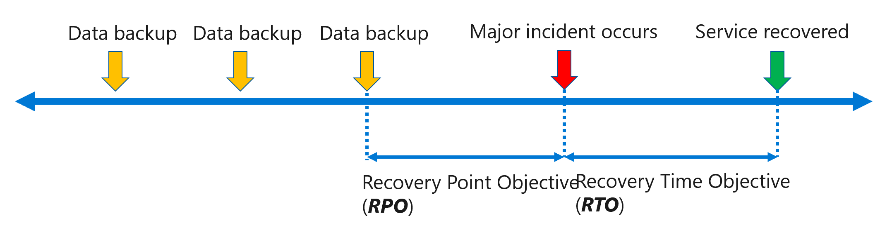
- __Mean time to recover (MTTR)__ is the average time it takes to restore a component after a failure.
- __Mean time between failures (MTBF)__ is the how long a component can reasonably expect to last between outages.

#### Design and Azure Site Recovery solution
Comparison
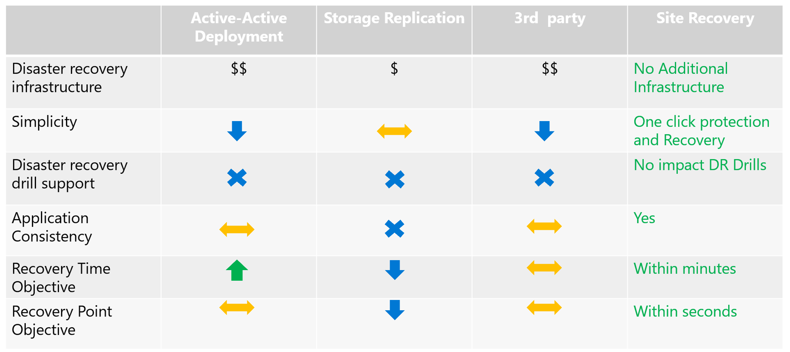

__Typical Azure application__
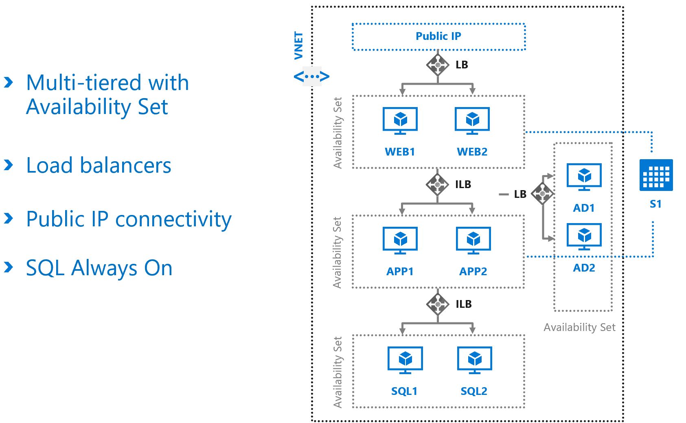

__Application-aware disaster recovery__
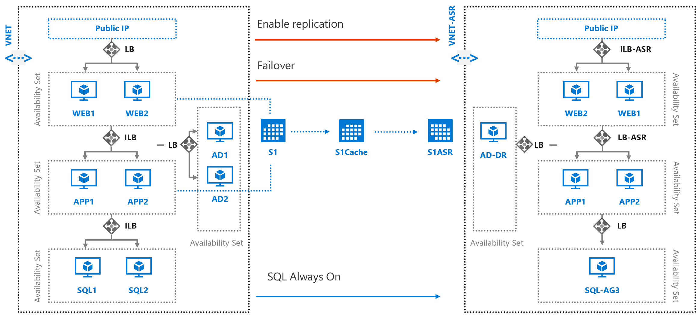

__Replicate and failover on-premises apps to Azure__
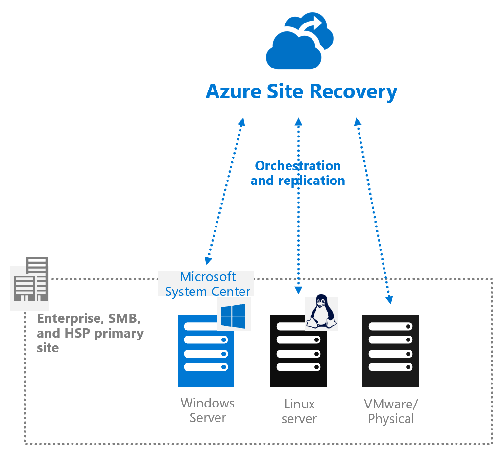

[__Disaster Recovery for Hyper-V__](https://aka.ms/asr_hyperv)
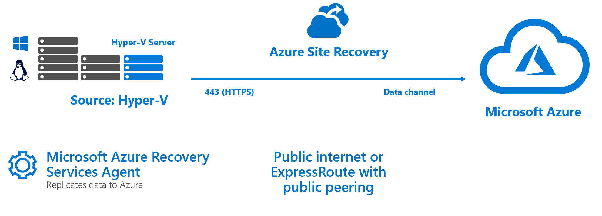

Whatch out for saturating the available network bandwidth: [here](https://docs.microsoft.com/en-us/azure/site-recovery/site-recovery-capacity-planner)
- Initial replication
- Delta replication and peaks

#### Recommend a solution for recovery in different regions
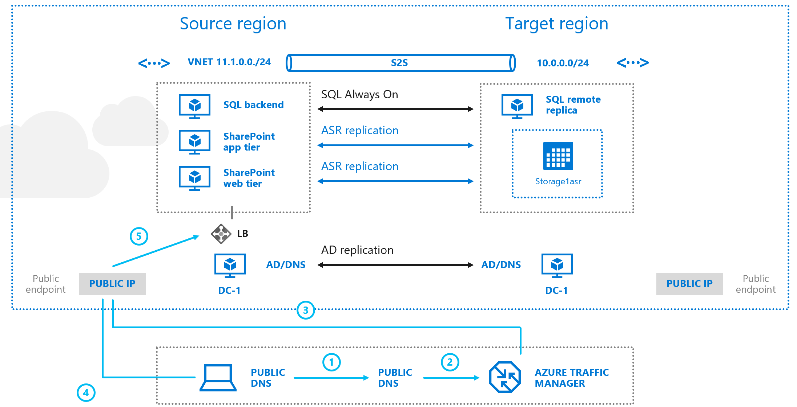

#### Recommend a solution for Azure Backup management

- What can I backup?
    - On-premises
        - Microsoft Azure Recovery Services (MARS) agent: files, folders and system state. [Support matrix](https://docs.microsoft.com/en-us/azure/backup/backup-support-matrix-mars-agent)
        - Azure Backup Server (MABS) agent: Hyper-V and VMWare VMs. [Support matrix](https://docs.microsoft.com/en-us/azure/backup/backup-mabs-protection-matrix)
    - Azure VMs ([backup extension](https://docs.microsoft.com/en-us/azure/backup/backup-azure-vms-introduction))
    - [Azure File shares](https://docs.microsoft.com/en-us/azure/backup/backup-afs)
    - [SQL Server in Azure VMs](https://docs.microsoft.com/en-us/azure/backup/backup-azure-sql-database)
        - Workload aware backups that support all backup types - full, differential, and log
        - 15-min RPO (recovery point objective) with frequent log backups
        - Point-in-time recovery up to a second
        - Individual database level backup and restore
    - SAP HANA databases in Azure VMs
- Hybrid deployment models
    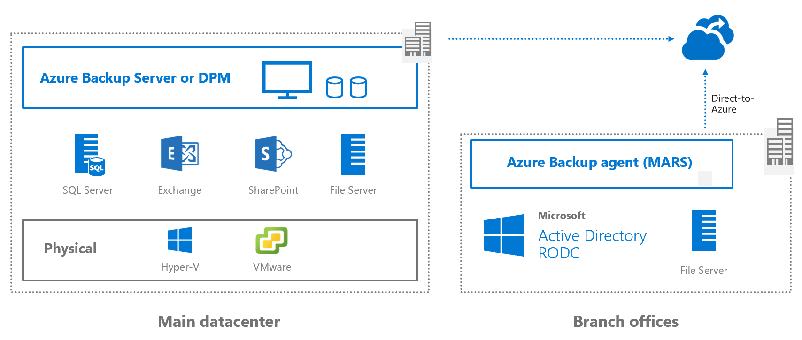
- Hybrid backup encryption
    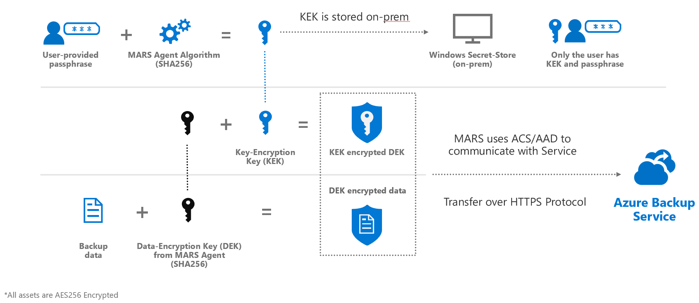
- Azure virtual machine disk encryption
    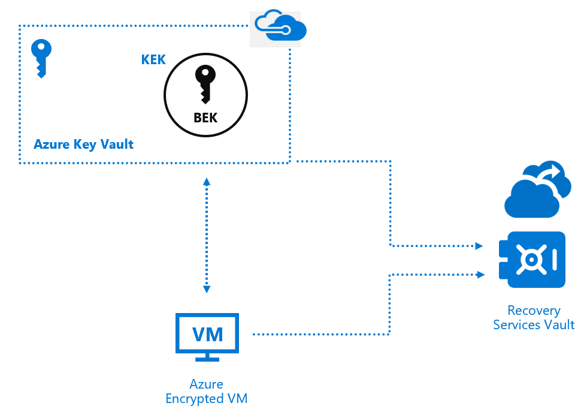
- Linux application-consistent backup
    
- Azure Backup monitoring with Azure Log Analytics
    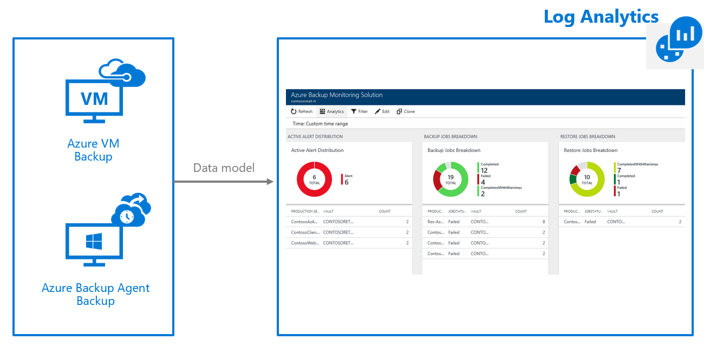
- Azure Backup reports with PowerBI
    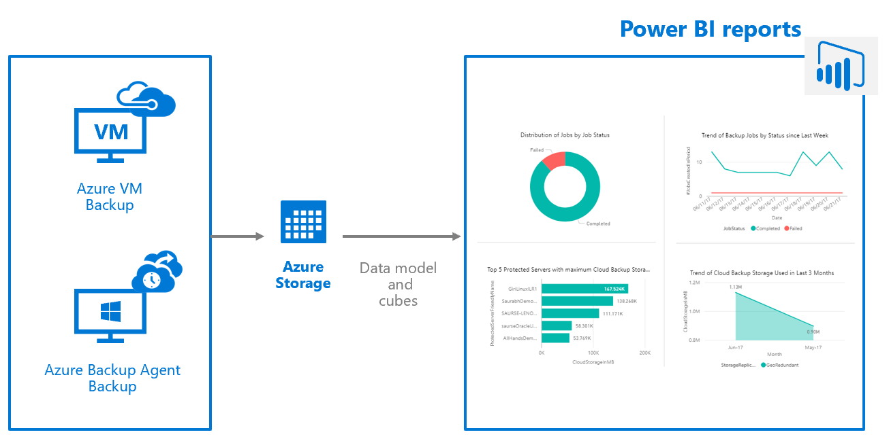

#### Design a solution for data archiving and retention

Data no longer needed can be removed, freeing up underlying storage

Examples:
- App Insights (monitoring) default retention = 90 days, up to 730 days
- Azure SQL Database long-term backup retention up to 10 years
- Immutable storage time based retention up to 400 years

## Design for high availability

#### Recommend a solution for application and workload redundancy, including compute, database, and storage

- Availability Sets
- Availability Zones
- LSR, ZRS, GRS, GZRS, RA-GRS, RA-GZRS
- VM scale set (using Availability Zones)

#### Recommend a solution for autoscaling

Vertical vs Horizontal scaling

Examples of services that provide autoscaling features:
- VM Scale Sets
- Azure App Service
- Service Fabric
- Azure Cloud Services
- Azure Functions

[Best practices](https://docs.microsoft.com/en-us/azure/architecture/best-practices/auto-scaling)

#### Identify resources that require high availability
#### Identify storage types for high availability
#### Recommend a solution for geo-redundancy of workloads