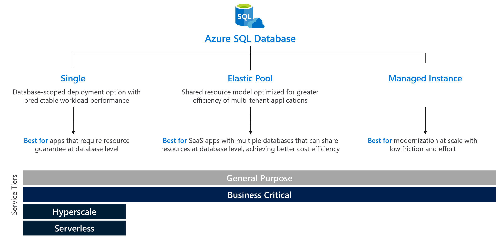
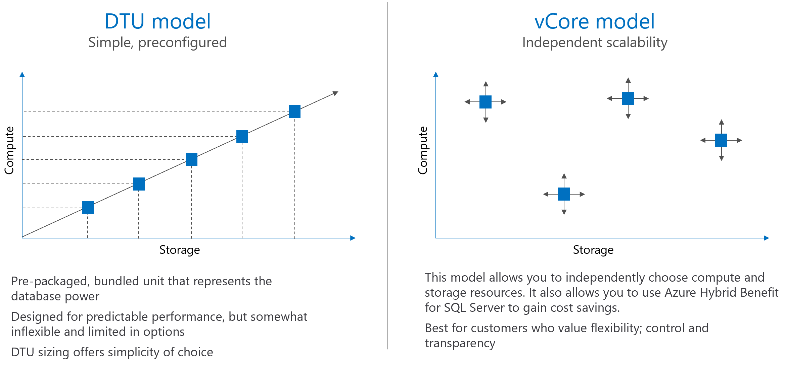
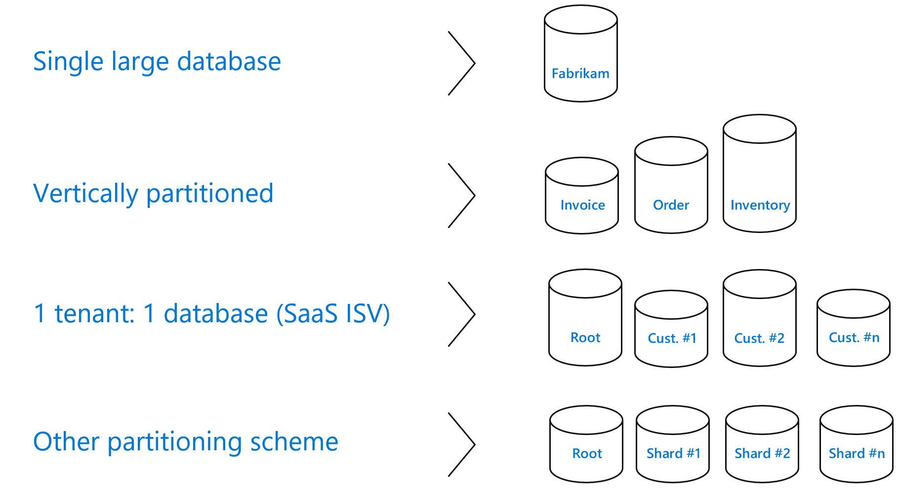
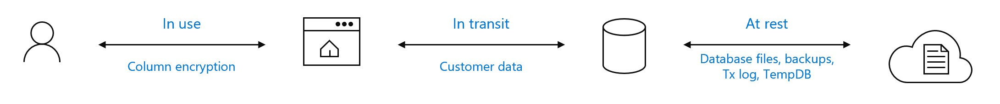
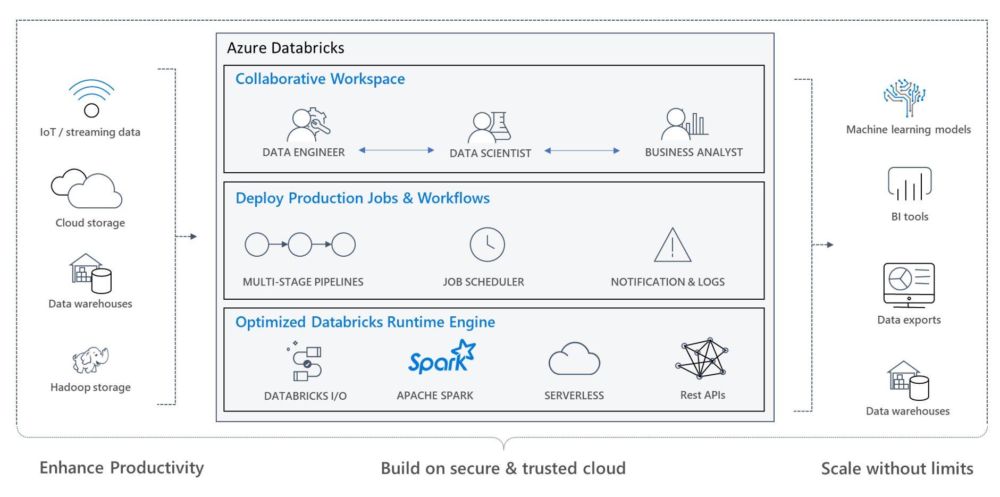

# Design Data Storage (15-20%)

## Design a solution for databases

#### Select an appropriate data platform based on requirements

- [Criteria for choosing a data store](https://docs.microsoft.com/en-us/azure/architecture/guide/technology-choices/data-store-comparison)
    - General criteria:
        - Functional and non-functional requirements
        - Management and cost considerations
        - Security
        - DevOps

    - Data stores
        - [Relational database management systems (RDBMS)](https://docs.microsoft.com/en-us/azure/architecture/guide/technology-choices/data-store-comparison#relational-database-management-systems-rdbms)
        - [Non-relational data stores](https://docs.microsoft.com/en-us/azure/architecture/data-guide/big-data/non-relational-data)
        - [Document databases](https://docs.microsoft.com/en-us/azure/architecture/guide/technology-choices/data-store-comparison#document-databases)
        - [Key/value stores](https://docs.microsoft.com/en-us/azure/architecture/guide/technology-choices/data-store-comparison#keyvalue-stores)
        - [Graph databases](https://docs.microsoft.com/en-us/azure/architecture/guide/technology-choices/data-store-comparison#graph-databases)
        - [Column-family databases](https://docs.microsoft.com/en-us/azure/architecture/guide/technology-choices/data-store-comparison#column-family-databases)
        - [Search engine databases](https://docs.microsoft.com/en-us/azure/architecture/guide/technology-choices/data-store-comparison#search-engine-databases)
        - [Data warehouse](https://docs.microsoft.com/en-us/azure/architecture/guide/technology-choices/data-store-comparison#data-warehouse)
        - [Time series databases](https://docs.microsoft.com/en-us/azure/architecture/guide/technology-choices/data-store-comparison#time-series-databases)
        - [Object storage](https://docs.microsoft.com/en-us/azure/architecture/guide/technology-choices/data-store-comparison#object-storage)
        - [Shared files](https://docs.microsoft.com/en-us/azure/architecture/guide/technology-choices/data-store-comparison#shared-files)

- [Traditional RDBMS workloads versus Big Data solutions](https://docs.microsoft.com/en-us/azure/architecture/data-guide/)

- [Online analytical processing (OLAP)](https://docs.microsoft.com/en-us/azure/architecture/data-guide/relational-data/online-analytical-processing)

- [Online transaction processing (OLTP)](https://docs.microsoft.com/en-us/azure/architecture/data-guide/relational-data/online-transaction-processing)

    - [Compare SQL relational databases on Azure](https://docs.microsoft.com/en-us/azure/architecture/data-guide/relational-data/online-transaction-processing#capability-matrix)

- [Data warehousing SMP or MPP](https://docs.microsoft.com/en-us/azure/architecture/data-guide/relational-data/data-warehousing#data-warehousing-in-azure)
    - Symmetric multiprocessing
    - Massively parallel processing

- [Components of a big data architecture](https://docs.microsoft.com/en-us/azure/architecture/data-guide/big-data/#components-of-a-big-data-architecture)

    

- [Components of a lambda data architecture](https://docs.microsoft.com/en-us/azure/architecture/data-guide/big-data/#lambda-architecture)

    

- [Choosing a data analytics technology](https://docs.microsoft.com/en-us/azure/architecture/data-guide/technology-choices/analysis-visualizations-reporting)

#### Recommend database service tier sizing

- Azure SQL Database deployment options

    

- DTU model versus vCore model

    

    - DTU model
        - __Basic__: Small databases particularly those in development phases
        - __Standard__: General purpose databases with moderate performance requirements
        - __Premium__: Mission-critical databases with high performance and high-availability requirements
    - vCore model
        - __General purpose__: Data applications with basic IO and basic availability requirements 
        - __Business Critical__: Business critical data applications with fast IO and high availability requirements
        - __Hyperscale__: VLDB OLTP and HTAP workloads with highly scalable storage and read-scale requirements

#### Recommend a solution for database scalability

- [Scaling up/down a single Azure SQL Database](https://docs.microsoft.com/en-us/azure/sql-database/sql-database-single-database-scale)
- [Scale elastic pool resources in Azure SQL Database](https://docs.microsoft.com/en-us/azure/sql-database/sql-database-elastic-pool-scale)
- [Hyperscale service tier](https://docs.microsoft.com/en-us/azure/sql-database/sql-database-service-tier-hyperscale)
- [Azure SQL Database Serverless](https://docs.microsoft.com/en-us/azure/sql-database/sql-database-serverless)
- [Request Units in Azure Cosmos DB](https://docs.microsoft.com/en-us/azure/cosmos-db/request-units)
- [Azure Analysis Services scale-out](https://docs.microsoft.com/en-us/azure/analysis-services/analysis-services-scale-out)

- Common database scalability patterns
    

#### Recommend a solution for encrypting data at rest, data in transmission, and data in use

| Data encryption | Encryption technology | Customer value |
| ----------------| ----------------------| ----------------- |
| __In transit__ | Transport Layer Security (TLS) from the client to the server | Protects data between client and server against snooping and man-in-the-middle attacks  *Azure SQL Database is phasing out Secure Sockets Layer (SSL) 3.0 and TLS 1.0 in favor of TLS 1.2 |
| __At rest__ |Transparent Data Encryption (TDE) for Azure SQL Database | Protects data on the disk Key management is done by Azure, which makes it easier to obtain compliance |
| __In use (end-to-end)__ | Always Encrypted for client-side column encryption | Data is protected end-to-end, but the application is aware of encrypted columns  This is used in the absence of data masking and TDE for compliance-related scenarios |

## Design data integration

#### Recommend a data flow to meet business requirements

- [ETL](https://docs.microsoft.com/en-us/azure/architecture/data-guide/relational-data/etl) versus [ELT](https://docs.microsoft.com/en-us/azure/architecture/data-guide/relational-data/etl#extract-load-and-transform-elt)

- [Azure Data Factory](https://docs.microsoft.com/en-us/azure/data-factory/)

- [Oozie on HDInsight](https://docs.microsoft.com/en-us/azure/hdinsight/hdinsight-use-oozie-linux-mac)

- [SQL Server Integration Services (SSIS)](https://docs.microsoft.com/en-us/sql/integration-services/sql-server-integration-services)

- [Capability matrix](https://docs.microsoft.com/en-us/azure/architecture/data-guide/technology-choices/pipeline-orchestration-data-movement#capability-matrix)

#### Recommend a solution for data integration, including Azure Data Factory, Azure Data Bricks, Azure Data Lake, Azure Synapse Analytics

- Azure Data Factory
    - ADF supported activities and pipelines
        - [Data Movement activities](https://docs.microsoft.com/en-us/azure/data-factory/concepts-pipelines-activities#data-movement-activities)
        - [Data Transformation activities](https://docs.microsoft.com/en-us/azure/data-factory/concepts-pipelines-activities#data-transformation-activities)
        - [Control flow activities](https://docs.microsoft.com/en-us/azure/data-factory/concepts-pipelines-activities#control-flow-activities)
    - ADF [Integration runtime types](https://docs.microsoft.com/en-us/azure/data-factory/concepts-integration-runtime#integration-runtime-types)
        - Azure
        - [Self-hosted](https://docs.microsoft.com/en-us/azure/data-factory/concepts-integration-runtime#self-hosted-integration-runtime)
        - [Azure-SSIS](https://docs.microsoft.com/en-us/azure/data-factory/concepts-integration-runtime#azure-ssis-integration-runtime)
    - ADF data flows
        - [mapping data flows](https://docs.microsoft.com/en-us/azure/data-factory/concepts-data-flow-overview)
        - [wrangling data flows](https://docs.microsoft.com/en-us/azure/data-factory/wrangling-data-flow-overview)

- Azure Databricks: [Apache Spark-based analytics platform](https://docs.microsoft.com/en-us/azure/azure-databricks/what-is-azure-databricks#apache-spark-in-azure-databricks)

    

    - Spark is designed to run on a Cluster
        - A cluster is a set of VMs
        - Spark can horizontally scale, bigger workload = Add more VMs 
        - Azure Databricks can automatically scale up and down 
        - Data can read from Azure Storage or Azure Datalake Storage
    - Why?
        - Data is never thrown away, because the data is stored in its raw format. - - This is especially useful in a big data environment, when you may not know in advance what insights are available from the data.
        - Users can explore the data and create their own queries.
        - May be faster than traditional ETL tools.
        - More flexible than a data warehouse, because it can store unstructured and semi-structured data.

- Azure Data Lake
    - [Azure Data Lake versus Blob Storage](https://docs.microsoft.com/en-us/azure/architecture/data-guide/technology-choices/data-storage#capability-matrix)

    | Capability | Azure Data Lake Store | Azure Blob Storage containers |
    | --- | --- | --- |
    | Purpose | Optimized storage for big data analytics workloads |General purpose object store for a wide variety of storage scenarios |
    | Use cases | Batch, streaming analytics, and machine learning data such as log files, IoT data, click streams, large datasets | Any type of text or binary data, such as application back end, backup data, media storage for streaming, and general purpose data |
    | Structure | Hierarchical file system | Object store with flat namespace |
    | Authentication | Based on Azure Active Directory Identities | Based on shared secrets, Account Access Keys and Shared Access Signature Keys, and role-based access control (RBAC) |
    | Authentication protocol | OAuth 2.0. Calls must contain a valid JWT (JSON web token) issued by Azure Active Directory | Hash-based message authentication code (HMAC). Calls must contain a Base64-encoded SHA-256 hash over a part of the HTTP request. |
    | Authorization | POSIX access control lists (ACLs). ACLs based on Azure Active Directory identities can be set file and folder level. | For account-level authorization use Account Access Keys. For account, container, or blob authorization use Shared Access Signature Keys. |
    | Auditing | Available.  |Available |
    | Encryption at rest | Transparent, server side | Transparent, server side; Client-side encryption |
    | Developer SDKs | .NET, Java, Python, Node.js | .Net, Java, Python, Node.js, C++, Ruby |
    | Analytics workload performance | Optimized performance for parallel analytics workloads, High Throughput and IOPS | Not optimized for analytics workloads |
    | Size limits | No limits on account sizes, file sizes or number of files | Specific limits documented [here](https://docs.microsoft.com/en-us/azure/azure-resource-manager/management/azure-subscription-service-limits#storage-limits) |
    | Geo-redundancy | Locally-redundant (LRS), globally redundant (GRS), read-access globally redundant (RA-GRS), zone-redundant (ZRS). | Locally redundant (LRS), globally redundant (GRS), read-access globally redundant (RA-GRS), zone-redundant (ZRS). See [here](https://docs.microsoft.com/en-us/azure/storage/common/storage-redundancy) for more information |

- Azure Synapse Analytics
    - Azure Synapse has four components:
        - SQL Analytics: Complete T-SQL based analytics – Generally Available
            - SQL pool (pay per DWU provisioned)
            - SQL on-demand (pay per TB processed) – (Preview)
        - Spark: Deeply integrated Apache Spark (Preview)
        - Data Integration: Hybrid data integration (Preview)
        - Studio: Unified user experience. (Preview)
    - Hash-distributed tables (requires a distribution column)
        
    Versus
    
    - Round-robin distributed tables (useful for staging table loads)
        - Bad performance when joining tables

[Modern data platform reference architecture](https://docs.microsoft.com/en-us/azure/architecture/example-scenario/dataplate2e/data-platform-end-to-end#architecture)

## Select an appropriate storage account

#### Choose between storage tiers

[__Type of storage accounts__](https://docs.microsoft.com/en-us/azure/storage/common/storage-account-overview#types-of-storage-accounts)

Azure Storage offers several types of storage accounts. Each type supports different features and has its own pricing model. Consider these differences before you create a storage account to determine the type of account that is best for your applications. The types of storage accounts are:

- **General-purpose v2 accounts**: Basic storage account type for blobs, files, queues, and tables. Recommended for most scenarios using Azure Storage.
- **General-purpose v1 accounts**: Legacy account type for blobs, files, queues, and tables. Use general-purpose v2 accounts instead when possible.
- **BlockBlobStorage accounts**: Storage accounts with premium performance characteristics for block blobs and append blobs. Recommended for scenarios with high transactions rates, or scenarios that use smaller objects or require consistently low storage latency.
- **FileStorage accounts**: Files-only storage accounts with premium performance characteristics. Recommended for enterprise or high performance scale applications.
- **BlobStorage accounts**: Legacy Blob-only storage accounts. Use general-purpose v2 accounts instead when possible.

The following table describes the types of storage accounts and their capabilities:

| Storage account type | Supported services                       | Supported performance tiers      | Supported access tiers         | Replication options               | Deployment model | Encryption |
|----------------------|------------------------------------------|-----------------------------|--------------------------------|-----------------------------------|------------------------------|------------------------|
| General-purpose V2   | Blob, File, Queue, Table, Disk, and Data Lake Gen2 | Standard, Premium | Hot, Cool, Archive | LRS, GRS, RA-GRS, ZRS, GZRS (preview), RA-GZRS (preview) | Resource Manager             | Encrypted              |
| General-purpose V1   | Blob, File, Queue, Table, and Disk       | Standard, Premium | N/A                            | LRS, GRS, RA-GRS                  | Resource Manager, Classic    | Encrypted              |
| BlockBlobStorage   | Blob (block blobs and append blobs only) | Premium                       | N/A                            | LRS, ZRS | Resource Manager             | Encrypted              |
| FileStorage   | File only | Premium                       | N/A                            | LRS, ZRS                               | Resource Manager             | Encrypted              |
| BlobStorage         | Blob (block blobs and append blobs only) | Standard                      | Hot, Cool, Archive | LRS, GRS, RA-GRS                  | Resource Manager             | Encrypted              |

[__Redundancy options__](https://docs.microsoft.com/en-us/azure/storage/common/storage-redundancy#summary-of-redundancy-options)

The following table shows how durable and available your data is in a given scenario, depending on which type of redundancy is in effect for your storage account:

| Scenario                                                                                                 | LRS                             | ZRS                              | GRS/RA-GRS                                  | GZRS/RA-GZRS (preview)                              |
| :------------------------------------------------------------------------------------------------------- | :------------------------------ | :------------------------------- | :----------------------------------- | :----------------------------------- |
| A node within a data center becomes unavailable                                                                 | Yes                             | Yes                              | Yes                                  | Yes                                  |
| An entire data center (zonal or non-zonal) becomes unavailable                                           | No                              | Yes                              | Yes                                  | Yes                                  |
| A region-wide outage occurs                                                                                     | No                              | No                               | Yes                                  | Yes                                  |
| Read access to data in the secondary region if the primary region becomes unavailable | No                              | No                               | Yes (with RA-GRS)                                   | Yes (with RA-GZRS)                                 |
| Percent durability of objects over a given year                                          | at least 99.999999999% (11 9's) | at least 99.9999999999% (12 9's) | at least 99.99999999999999% (16 9's) | at least 99.99999999999999% (16 9's) |
| Supported storage account types                                                                   | GPv2, GPv1, BlockBlobStorage, BlobStorage, FileStorage                | GPv2, BlockBlobStorage, FileStorage                             | GPv2, GPv1, BlobStorage                     | GPv2                     |
| Availability SLA for read requests  | At least 99.9% (99% for cool access tier) | At least 99.9% (99% for cool access tier) | At least 99.9% (99% for cool access tier) for GRS  At least 99.99% (99.9% for cool access tier) for RA-GRS | At least 99.9% (99% for cool access tier) for GZRS  At least 99.99% (99.9% for cool access tier) for RA-GZRS |
| Availability SLA for write requests  | At least 99.9% (99% for cool access tier) | At least 99.9% (99% for cool access tier) | At least 99.9% (99% for cool access tier) | At least 99.9% (99% for cool access tier) |

[__Cloud tiered blob storage__](https://docs.microsoft.com/en-us/azure/storage/blobs/storage-blob-storage-tiers?tabs=azure-portal)

#### Recommend a storage access solution

[__Authorizing access to data in Azure Storage__](https://docs.microsoft.com/en-us/azure/storage/common/storage-auth)

|  |Shared Key (storage account key)  |Shared access signature (SAS)  |Azure Active Directory (Azure AD)  |Active Directory (preview) |Anonymous public read access  |
|---------|---------|---------|---------|---------|---------|
|Azure Blobs     |Supported         |Supported         |Supported         |Not supported|Supported         |
|Azure Files (SMB)     |Supported         |Not supported         |Supported, only with AAD Domain Services         |Supported, credentials must be synced to Azure AD|Not supported         |
|Azure Files (REST)     |Supported         |Supported         |Not supported         |Not supported |Not supported         |
|Azure Queues     |Supported         |Supported         |Supported         |Not Supported | Not supported         |
|Azure Tables     |Supported         |Supported         |Not supported         |Not supported| Not supported         |

#### Recommend storage management tools

- AzCopy
- Azure Storage Explorer
- Visual Studio extensions
- Azure Data Factory
- Import/Export service
- Azure Databox
- Rest API’s
