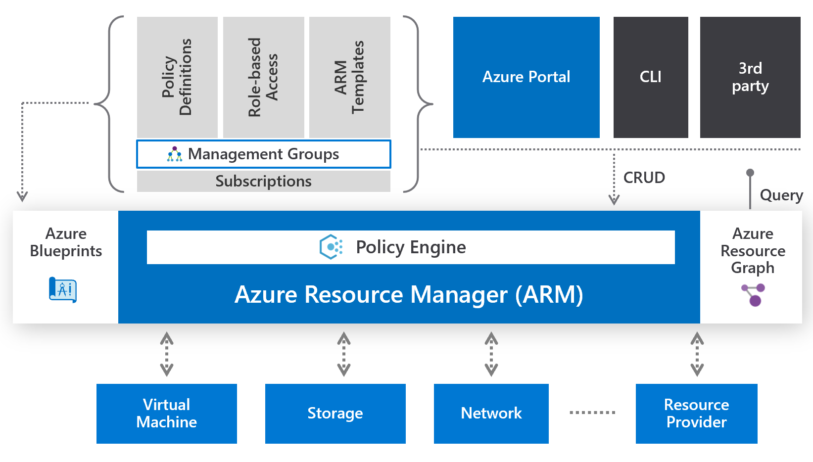
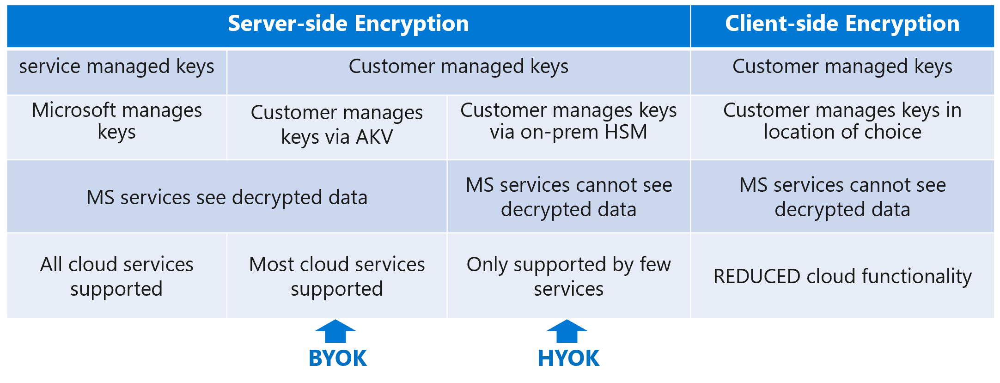

# Design Identity and Security (25-30%)

## Design authentication

#### Recommend a solution for single sign-on

- __With single sign-on__, users sign in once with one account to access domain-joined devices, company resources, software as a service (SaaS) applications, and web applications.
- __Without single sign-on__, users must remember application-specific passwords and sign in to each application.

This flowchart helps you decide which single sign-on method is best for your situation. More information [here](https://docs.microsoft.com/en-us/azure/active-directory/manage-apps/what-is-single-sign-on)

- Use __OpenID Connect__ and __OAuth__ when developing a new application. This protocol simplifies application configuration, has easy-to-use SDKs, and enables your application to use MS Graph.
- Choose __SAML__ whenever possible for existing applications that do not use OpenID Connect or OAuth. SAML works for applications that authenticate using one of the SAML protocols.
- Choose __password-based__ when the application authenticates with username and password. Password-based single sign-on enables secure application password storage and replay using a web browser extension or mobile app. This method uses the existing sign-in process provided by the application, but enables an administrator to manage the passwords.
- Choose __linked__ sign-on when the application is configured for single sign-on in another identity provider service. This option doesn't add single sign-on to the application. However, the application might already have single sign-on implemented using another service such as Active Directory Federation Services
- Choose __disabled__ single sign-on when the app isn't ready to be configured for single sign-on. 
- Choose __Integrated Windows Authentication__, or claims-aware applications.
- Use __header-based__ single sign-on when the application uses headers for authentication. Header-based single sign-on requires PingAccess for Azure AD. Application Proxy uses Azure AD to authenticate the user and then passes traffic through the connector service.

#### How does OpenID Connect work?
The most basic sign-in flow has the steps shown in the next diagram [link](https://docs.microsoft.com/en-us/azure/active-directory/develop/v2-protocols-oidc#protocol-diagram-sign-in)

Many web apps need to not only sign the user in, but also to access a web service on behalf of the user by using OAuth. Use OpenID Connect for user authentication while simultaneously getting an authorization code that you can use to get access tokens if you are using the OAuth authorization code flow.

#### Recommend a solution for authentication

Azure AD authentication includes the following components:

- [Self-service password reset](https://docs.microsoft.com/en-us/azure/active-directory/authentication/concept-sspr-howitworks).

  Requires you to:
    1. configure a number of authentication options (what methods are available to users)
    2. know about the password reset policies ([here](https://docs.microsoft.com/en-us/azure/active-directory/authentication/concept-sspr-policy))
    2. require users to register when they sign in
    3. configure write-back passwords to on-premise
    4. report on password management

- [Azure Multi-Factor Authentication](https://docs.microsoft.com/en-us/azure/active-directory/authentication/concept-mfa-howitworks). 

  Requires you to:
  1. assign licenses to users
  2. turn on MFA for your users
  3. notify them
- [Hybrid integration to write password changes back to on-premises environment](https://docs.microsoft.com/en-us/azure/active-directory/authentication/tutorial-enable-sspr-writeback)

  Password writeback is supported in environments that use:

    - Active Directory Federation Services
    - Password hash synchronization
    - Pass-through authentication

  More information ([here](https://docs.microsoft.com/en-us/azure/active-directory/authentication/concept-sspr-writeback))

- [Hybrid integration to enforce password protection policies for an on-premises environment](https://docs.microsoft.com/en-us/azure/active-directory/authentication/tutorial-configure-custom-password-protection)
  - [Eliminate weak passwords in the cloud](https://docs.microsoft.com/en-us/azure/active-directory/authentication/concept-password-ban-bad)
  - [Eliminate weak passwords on-premises](https://docs.microsoft.com/en-us/azure/active-directory/authentication/concept-password-ban-bad-on-premises)

  The following diagram shows how the basic components of Azure AD Password Protection work together in an on-premises Active Directory environment More information ([here](https://docs.microsoft.com/en-us/azure/active-directory/authentication/howto-password-ban-bad-on-premises-deploy)):
    

    - Audit mode versus Enforced mode ([here](https://docs.microsoft.com/en-us/azure/active-directory/authentication/howto-password-ban-bad-on-premises-operations#modes-of-operation))

- [Passwordless authentication](https://docs.microsoft.com/en-us/azure/active-directory/authentication/concept-authentication-passwordless):
  - [Windows Hello for Business](https://docs.microsoft.com/en-us/windows/security/identity-protection/hello-for-business/hello-overview)
  - [Microsoft Authenticator app](https://docs.microsoft.com/en-us/azure/active-directory/authentication/concept-authentication-passwordless#microsoft-authenticator-app) (You can use Authenticator App as a passwordless option)
  - [FIDO2 security keys](https://docs.microsoft.com/en-us/azure/active-directory/authentication/concept-authentication-passwordless#fido2-security-keys)

#### Recommend a solution for Conditional Access, including multi-factor authentication

Conditional Access policies are enforced after the first-factor authentication has been completed. Conditional Access is not intended as an organization's first line of defense for scenarios like denial-of-service (DoS) attacks, but can use signals from these events to determine access.

- [Conditional Access policies](https://docs.microsoft.com/en-us/azure/active-directory/conditional-access/concept-conditional-access-policy-common)
  - Require MFA for administrators
  - Require MFA for Azure management
  - Require MFA for all users
  - Block legacy authentication
  - Risk-based Conditional Access (Requires Azure AD Premium P2)
  - Require trusted location for MFA registration
  - Block access by location
  - Require compliant device
- A Conditional Access policy must include a [user assignment](https://docs.microsoft.com/en-us/azure/active-directory/conditional-access/concept-conditional-access-users-groups) as one of the signals in the decision process. Users can be included or excluded from Conditional Access policies.
- Conditional Access policies allow administrators to assign controls to [specific applications](https://docs.microsoft.com/en-us/azure/active-directory/conditional-access/concept-conditional-access-cloud-apps) or [actions](https://docs.microsoft.com/en-us/azure/active-directory/authentication/concept-registration-mfa-sspr-combined).
- Within a Conditional Access policy, an administrator can make use of signals from conditions like risk, device platform, or location to enhance their policy decisions.
  - Sign-in risk
  - Device platform
  - Location
  - Client apps (browser or desktop applications)
  - Device state
- [Named locations](https://docs.microsoft.com/en-us/azure/active-directory/conditional-access/location-condition) can be based on:
  - IP ranges
  - Countries/Regions

#### Recommend a solution for network access authentication

- [Azure network security overview](https://docs.microsoft.com/en-us/azure/security/fundamentals/network-overview)
- Network access control
    - Network Security Groups (NSGs do not provide application layer inspection or authenticated access controls)
    - Just in time VM access
    - Service Endpoints
    - User defined routing
    - Forced tunneling
    - NVA Network Virtual Appliances
- Azure Firewall

#### Recommend a solution for a hybrid identity including Azure AD Connect and Azure AD Connect Health

[Decision tree](https://docs.microsoft.com/en-us/azure/security/fundamentals/choose-ad-authn) whether to deploy cloud or federated authentication for your Azure AD hybrid identity solution

Various [topologies](https://docs.microsoft.com/en-us/azure/active-directory/hybrid/plan-connect-topologies) for Azure AD Connect

- Single forest, single Azure AD tenant

- Single forest, multiple sync servers to one Azure AD tenant

- Multiple forests, single Azure AD tenant

- Multiple forests, multiple sync servers to one Azure AD tenant

- Staging servers

- Multiple Azure AD tenants

- Each object only once in an Azure AD tenant

- Each object multiple times in an Azure AD tenant

#### Recommend a solution for user self-service password reset

- [How password reset works](https://docs.microsoft.com/en-us/azure/active-directory/authentication/concept-sspr-howitworks)
- [Customize the Azure AD functionality for self-service password reset](https://docs.microsoft.com/en-us/azure/active-directory/authentication/concept-sspr-customization)
- [Licenses needed](https://docs.microsoft.com/en-us/azure/active-directory/authentication/concept-sspr-customization)
- [Password writeback](https://docs.microsoft.com/en-us/azure/active-directory/authentication/concept-sspr-writeback)

#### Recommend and implement a solution for B2B integration 

External user = any account that is not owned by an organization. 
- B2B users

Guest vs Member
- User type attribute can be changed on any user account
- Synced users by default are members (can use AD Connect sync rules to change)
- B2B users by default are guests (can use PowerShell to change)

Customers typically use the terms "guests" and "B2B user" interchangeably

Types of B2B user states:
- Invited user
- External Azure Active Directory
- MSA
- Google
- Other – aka direct federation
- OTP

Invitation methods:
- Azure AD portal or Office portals
- Users can invite from Office apps
- Admins can bulk invite via:
    - Powershell
    - Graph API
    - Azure AD Portal (via CSV upload)

Redemption
- Depending on the inviting organization's needs, an Azure AD B2B collaboration user can be in one of the following account states:

With Azure AD B2B collaboration, a tenant admin can set the following invitation policies:
- Turn off invitations
- Only admins and users in the Guest Inviter role can invite
- Admins, the Guest Inviter role, and members can invite
- All users, including guests, can invite

## Design authorization

#### Choose an authorization approach

- RBAC
- Custom Role

#### Recommend a hierarchical structure that includes management groups, subscriptions and resource groups

#### Recommend an access management solution including RBAC policies, access reviews, role assignments, physical access, Privileged Identity Management (PIM), Azure AD Identity Protection, Just In Time (JIT) access

- Azure AD Identity Protection
  - Your organization can use Identity Protection to automate the detection, investigation, and remediation of risks related to users' identities
  - User risks and Sign-in risks
  - There are two different ways to detect and handle identity risks: self-remediation or remediated by administrators
  - Risk policies make it possible for your organization to respond more appropriately to identity risk.

## Design governance

#### Recommend a strategy for tagging
- Use tags for organizing your resources, doing automation and scenarios such as chargeback accounting. 
- Tagging decision guide ([link](https://docs.microsoft.com/en-us/azure/cloud-adoption-framework/decision-guides/resource-tagging))

- Tags applied to the resource group or subscription aren't inherited by the resources
- You can retrieve information about tags through the Azure Resource Usage and RateCard APIs or the usage comma-separated values (CSV) file.
- Not all resource types support tags ([link](https://docs.microsoft.com/en-us/azure/azure-resource-manager/management/tag-support))
- Each resource, resource group, and subscription can have a maximum of 50 tag name/value pairs.
- You use Azure Policy to enforce tagging rules and conventions ([link](https://docs.microsoft.com/en-us/azure/azure-resource-manager/management/tag-policies))

#### Recommend a solution for using Azure Policy

- Enforcement & compliance
  - Turn on built-in policies or build custom ones for all resource types
  - Real-time policy evaluation and enforcement
  - Periodic & on-demand compliance evaluation
- Apply policies
  - Apply policies to a Management Group with control across your entire organization, Subscriptions and Resource groups
  - Apply multiple policies and & aggregate policy states with policy initiatives
  - Exclusion Scope
- Remediate
  - Remediate existing resources at scale
  - Automate remediation through runbooks, functions and logic apps
  - Trigger alerts when a resource is out of compliance

#### Recommend a solution for using Azure Blueprint

- Streamline environment creation
  - Centralize environment creation through templates
  - Add resources, policies and role access controls
  - Track blueprint updates through versioning
- Enable compliant development
  - Empower developers to create fully governed environments through self-service
  - Create multiple dev-ready environments and subscriptions from a centralize location
  - Leverage the integration with Azure Policy on the DevOps lifecycle

- Lock foundational resources
  - Ensure foundational resources cannot be changed by subscription owners
  - Manage locks through a centralize location
  - Update locked resource through blueprint definition updates

- Blueprint sample strategy ([link](https://docs.microsoft.com/en-us/azure/governance/blueprints/samples/))

  

## Design security for applications

#### Recommend a solution that includes KeyVault

- [Azure Encryption at rest models](https://docs.microsoft.com/en-us/azure/security/fundamentals/encryption-atrest)
   
- Cosmos DB doesn't allow you to bring your own key (keys are managed by Microsoft)
- Combine with Always Encrypted feature of SQL Server or Azure SQL Database
- There are 3 ways to authenticate against Key Vault
  - Managed Identities
  - Service principal and certificate (not recommended because you have to rotate certificate)
  - Service principal and secret (not recommended)
- Reduce network access to Key Vault
  - VNET Service EndPoints ([link](https://docs.microsoft.com/en-us/azure/key-vault/key-vault-overview-vnet-service-endpoints))
  - Configure Azure Key Vault firewalls and virtual networks ((link)[https://docs.microsoft.com/en-us/azure/key-vault/key-vault-network-security])
- All API calls will be logged, allowing you to monitor/audit
- Use Key Vault references for App Service and Azure Functions ([link](https://docs.microsoft.com/en-us/azure/app-service/app-service-key-vault-references))
- Azure Disk Encryption uses Key Vault ([link](https://docs.microsoft.com/en-us/azure/security/fundamentals/azure-disk-encryption-vms-vmss))
- Azure Security Baseline for Key Vault ([link](https://docs.microsoft.com/en-us/azure/key-vault/security-baseline))

#### What can be stored in KeyVault

- Keys
- Certificates
- Secrets

#### KeyVault operations

See [here](https://docs.microsoft.com/en-us/azure/security/fundamentals/azure-disk-encryption-vms-vmss)

#### KeyVault regions

The contents of your key vault are replicated within the region and to a secondary region at least 150 miles away but within the same geography.

If individual components within the key vault service fail, alternate components within the region step in to serve your request to make sure that there is no degradation of functionality. You do not need to take any action to trigger this. It happens automatically and will be transparent to you.

See this [link](https://docs.microsoft.com/en-us/azure/key-vault/key-vault-disaster-recovery-guidance)

In the rare event that an entire Azure region is unavailable, the requests that you make of Azure Key Vault in that region are automatically routed (failed over) to a secondary region. 

#### Recommend a solution that includes Azure AD Managed Identities

- The following diagram shows how managed service identities work with Azure virtual machines (VMs):

- Difference between system-assigned managed identity and user-assigned managed identity ([link](https://docs.microsoft.com/en-us/azure/active-directory/managed-identities-azure-resources/overview))

- Azure services that support managed identities ([here](https://docs.microsoft.com/en-us/azure/active-directory/managed-identities-azure-resources/services-support-managed-identities))

    - Virtual Machines and Scale Sets
    - App Service
    - Blueprints
    - Functions
    - Logic Apps
    - Data Factory V2
    - API Management
    - Container Instances
    - Container Registry Tasks
    - Service Fabric

  Check out the article for a list of Azure resources that support Azure AD authentication ([here](https://docs.microsoft.com/en-us/azure/active-directory/managed-identities-azure-resources/services-support-managed-identities#azure-services-that-support-azure-ad-authentication))  

  - Aqcuire access token via IMDS Azure Instance Metadata Service. Ex GET 'http://169.254.169.254/metadata/identity/oauth2/token?api-version=2018-02-01&resource=https://management.azure.com/' HTTP/1.1 Metadata: true

#### Recommend a solution for integrating applications into Azure AD

- tbd