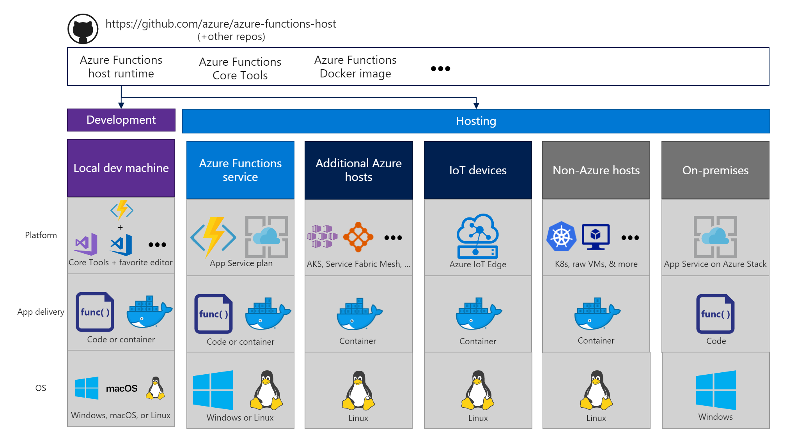
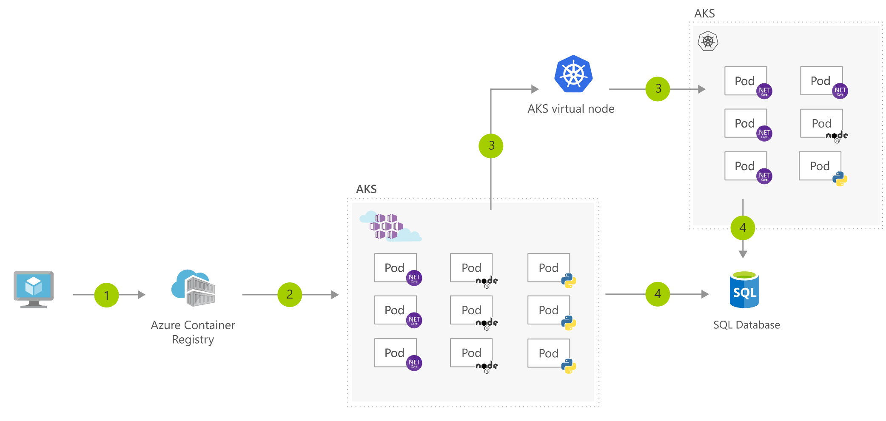
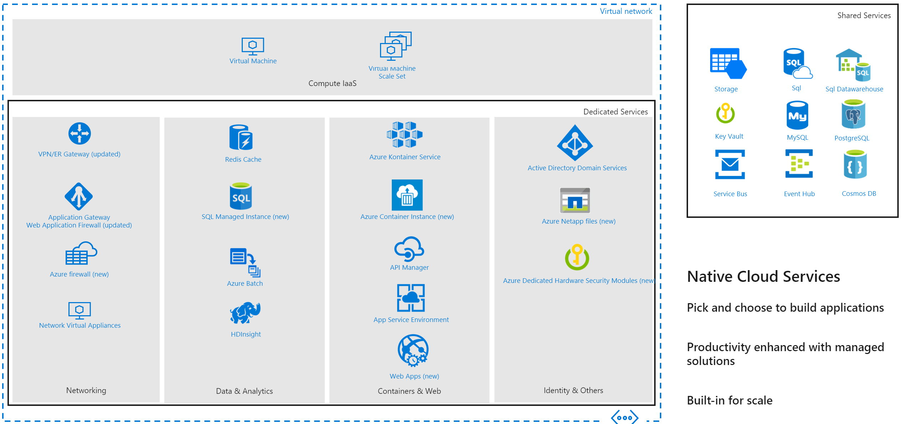
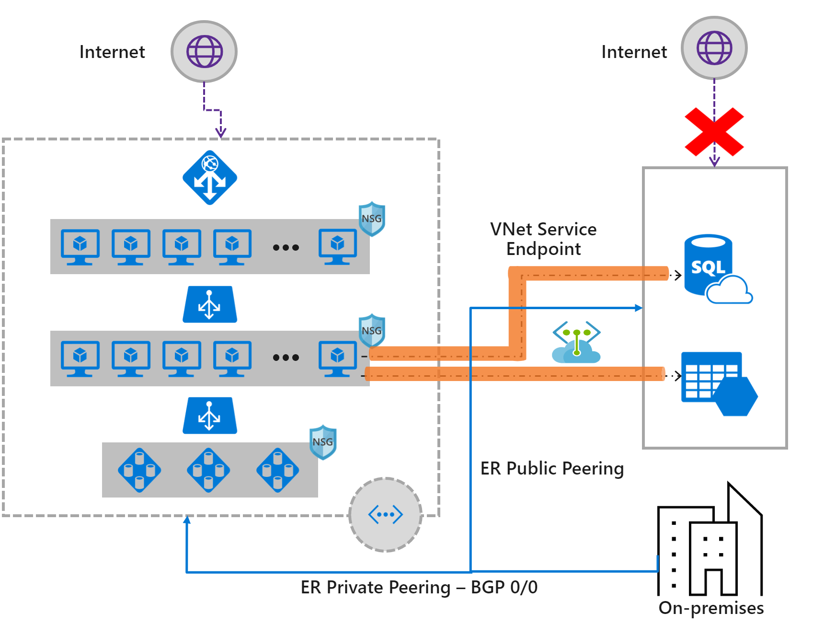
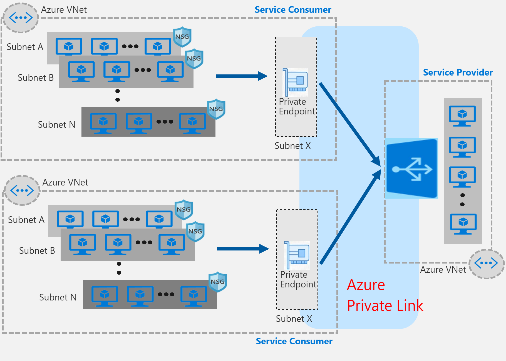

# Design Infrastructure (25-30%)
---------------------------------

## Design a compute solution

#### Recommend a solution for compute provisioning

- [Declarative versus Imperative](https://docs.microsoft.com/en-us/azure/architecture/framework/devops/iac#automation-of-azure-deployments)
- [Azure ARM Templates​](https://docs.microsoft.com/en-us/azure/azure-resource-manager/templates/template-tutorial-create-first-template?tabs=azure-powershell)
- [Azure Provider for Terraform​](https://www.terraform.io/docs/providers/azurerm/index.html)
- [Ansible with Azure​](https://docs.microsoft.com/en-us/azure/ansible/ansible-overview)
- [Chef](https://docs.microsoft.com/en-us/azure/chef/) or [Puppet​](https://puppet.com/integrations/microsoft-windows-azure/)

- [Azure PowerShell​](https://docs.microsoft.com/en-us/powershell/azure)
- [Azure CLI​](https://docs.microsoft.com/en-us/cli/azure/?view=azure-cli-latest)
- [Azure REST API’s​](https://docs.microsoft.com/en-us/rest/api/azure/)
- [Azure SDKs​](https://docs.microsoft.com/en-us/azure/?product=featured#pivot=sdkstools)

Example CI/CD Pipelines that can be used to provision resources

- [Azure DevOps CI/CD pipelines for VM’s](https://docs.microsoft.com/en-us/azure/architecture/solution-ideas/articles/cicd-for-azure-vms)

    1. Change application source code
    2. Commit Application Code and Azure Resource Manager (ARM) Template
    3. Continuous integration triggers application build and unit tests
    4. Continuous deployment trigger orchestrates deployment of application artifacts with environment-specific parameters
    5. Deployment to QA environment
    6. Deployment to staging environment
    7. Deployment to production environment
    8. Application Insights collects and analyses health, performance, and usage data
    9. Review health, performance and usage information
    10. Update backlog item

- [Azure DevOps CI/CD for Azure Web Apps](https://docs.microsoft.com/en-us/azure/architecture/solution-ideas/articles/azure-devops-continuous-integration-and-continuous-deployment-for-azure-web-apps)

    1. Change application source code.
    2. Commit application code and Web Apps web.config file.
    3. Continuous integration triggers application build and unit tests.
    4. Continuous deployment trigger orchestrates deployment of application 5. 5.5.5. artifacts with environment-specific parameters.
    6. Deployment to Web Apps.
    7. Azure Application Insights collects and analyzes health, performance, and usage data.
    8. Review health, performance, and usage information.
    9. Update backlog item.

- [Azure DevOps CI/CD for containers](https://docs.microsoft.com/en-us/azure/architecture/solution-ideas/articles/cicd-for-containers)

    1. Change application source code
    2. Commit Application Code
    3. Continuous integration triggers application build, container image build and unit tests
    4. Container image pushed to Azure Container Registry
    5. Continuous deployment trigger orchestrates deployment of application artifacts with environment-specific parameters
    6. Deployment to Azure Kubernetes Service (AKS)
    7. Container is launched using Container Image from Azure Container Registry
    8. Application Insights collects and analyses health, performance, and usage data
    9. Review health, performance and usage information
    10. Update backlog item

- [Container CI/CD using Jenkins and Kubernetes on Azure Kubernetes Service (AKS)](https://docs.microsoft.com/en-us/azure/architecture/solution-ideas/articles/container-cicd-using-jenkins-and-kubernetes-on-azure-container-service)

    1. Change application source code.
    2. Commit code to GitHub.
    3. Continuous Integration Trigger to Jenkins.
    4. Jenkins triggers a build job using Azure Kubernetes Service (AKS) for a dynamic build agent.
    5. Jenkins builds and pushes Docker container to Azure Container Registry.
    6. Jenkins deploys your new containerized app to Kubernetes on Azure.
    7. Container Service (AKS), backed by Azure Cosmos DB.
    8. Grafana displays visualization of infrastructure and application metrics via Azure Monitor.
    9. Monitor application and make improvements.

- [Immutable Infrastructure CI/CD using Jenkins and Terraform](https://docs.microsoft.com/en-us/azure/architecture/solution-ideas/articles/immutable-infrastructure-cicd-using-jenkins-and-terraform-on-azure-virtual-architecture-overview)

    1. Change application source code.
    2. Commit code to GitHub.
    3. Continuous Integration Trigger to Jenkins.
    4. Jenkins triggers a Packer image build to create a VM and stores it as a VM image using Azure Managed Disks.
    5. Jenkins triggers Terraform to provision a new Virtual Machine Scale Set using the Azure Managed Disks VM image.
    6. Azure Log Analytics collects and analyzes logs.
    7. Monitor application and make improvements.

#### Determine appropriate compute technologies, including virtual machines, App Services, Service Fabric, Azure Functions, Windows Virtual Desktop, and containers

- [Decision tree for compute](https://docs.microsoft.com/en-us/azure/architecture/guide/technology-choices/compute-decision-tree)

    [Hosting model comparison​](https://docs.microsoft.com/en-us/azure/architecture/guide/technology-choices/compute-decision-tree#hosting-model)
    
    | Criteria | Virtual Machines | App Service | Service Fabric | Azure Functions | Azure Kubernetes Service | Container Instances | Azure Batch |
    |----------|-----------------|-------------|----------------|-----------------|-------------------------|----------------|-------------|
    | Application composition | Agnostic | Applications, containers | Services, guest executables, containers | Functions | Containers | Containers | Scheduled jobs  |
    | Density | Agnostic | Multiple apps per instance via app service plans | Multiple services per VM | Serverless  | Multiple containers per node |No dedicated instances | Multiple apps per VM |
    | Minimum number of nodes | 1 | 1 | 5 | Serverless | 3 | No dedicated nodes | 1 |
    | State management | Stateless or Stateful | Stateless | Stateless or stateful | Stateless | Stateless or Stateful | Stateless | Stateless |
    | Web hosting | Agnostic | Built in | Agnostic | Not applicable | Agnostic | Agnostic | No |
    | Can be deployed to dedicated VNet? | Supported | Supported | Supported | Supported | Supported | Not supported | Supported |
    | Hybrid connectivity | Supported | Supported | Supported | Supported | Supported | Not supported | Supported |

- [Sizes for virtual machines in Azure​](https://docs.microsoft.com/en-us/azure/virtual-machines/linux/sizes)

    | Type | Sizes | Description |
    |------|-------|-------------|
    | General purpose | B, Dsv3, Dv3, Dasv4, Dav4, DSv2, Dv2, Av2, DC, DCv2  | Balanced CPU-to-memory ratio. Ideal for testing and development, small to medium databases, and low to medium traffic web servers. |
    | Compute optimized | Fsv2 | High CPU-to-memory ratio. Good for medium traffic web servers, network appliances, batch processes, and application servers. |
    | Memory optimized | Esv3, Ev3, Easv4, Eav4, Mv2, M, DSv2, Dv2 | High memory-to-CPU ratio. Great for relational database servers, medium to large caches, and in-memory analytics.                 |
    | Storage optimized | Lsv2 | High disk throughput and IO ideal for Big Data, SQL, NoSQL databases, data warehousing and large transactional databases.  |
    | GPU | NC, NCv2, NCv3, ND, NDv2 (Preview), NV, NVv3, NVv4 | Specialized virtual machines targeted for heavy graphic rendering and video editing, as well as model training and inferencing (ND) with deep learning. Available with single or multiple GPUs. |
    | High performance compute | HB, HBv2, HC,  H | Our fastest and most powerful CPU virtual machines with optional high-throughput network interfaces (RDMA). |

- [Scalability comparison​](https://docs.microsoft.com/en-us/azure/architecture/guide/technology-choices/compute-decision-tree#scalability)

    | Criteria | Virtual Machines | App Service | Service Fabric | Azure Functions | Azure Kubernetes Service | Container Instances | Azure Batch |
    |----------|-----------------|-------------|----------------|-----------------|-------------------------|----------------|-------------|
    | Autoscaling | Virtual machine scale sets | Built-in service | Virtual machine scale sets | Built-in service | Pod auto-scaling, cluster auto-scaling | Not supported | N/A |
    | Load balancer | Azure Load Balancer | Integrated | Azure Load Balancer | Integrated | Azure Load Balancer or Application Gateway |  No built-in support | Azure Load Balancer |
    | Scale limit | Platform image: 1000 nodes per scale set, Custom image: 600 nodes per scale set | 20 instances, 100 with App Service Environment | 100 nodes per scale set | 200 instances per Function app | 100 nodes per cluster (default limit) |20 container groups per subscription (default limit). | 20 core limit (default limit). |

- [SLA comparison](https://docs.microsoft.com/en-us/azure/architecture/guide/technology-choices/compute-decision-tree#availability)

    | Criteria | Virtual Machines | App Service | Service Fabric | Azure Functions | Azure Kubernetes Service | Container Instances | Azure Batch |
    |----------|-----------------|-------------|----------------|-----------------|-------------------------|----------------|-------------|
    | SLA | [SLA for Virtual Machines][sla-vm] | [SLA for App Service][sla-app-service] | [SLA for Service Fabric][sla-sf] | [SLA for Functions][sla-functions] | [SLA for AKS][sla-acs] | [SLA for Container Instances](https://azure.microsoft.com/support/legal/sla/container-instances/) | [SLA for Azure Batch][sla-batch] |
    | Multi region failover | Traffic manager | Traffic manager | Traffic manager, Multi-Region Cluster | Not supported | Traffic manager | Not supported | Not Supported |

- [Azure Functions – Hosting plans​](https://docs.microsoft.com/en-us/azure/azure-functions/functions-scale)

    The hosting plan you choose dictates the following behaviors:

    * How your function app is scaled.
    * The resources available to each function app instance.
    * Support for advanced features, such as Azure Virtual Network connectivity.

     __Premium plan__ supports the following features:

    * Perpetually warm instances to avoid any cold start
    * VNet connectivity
    * Unlimited execution duration (60 minutes guaranteed)
    * Premium instance sizes (one core, two core, and four core instances)
    * More predictable pricing
    * High-density app allocation for plans with multiple function apps

    Consider [function timeout behavior](https://docs.microsoft.com/en-us/azure/azure-functions/functions-scale#timeout)

    | Plan | Runtime Version | Default | Maximum |
    |------|---------|---------|---------|
    | Consumption | 1.x | 5 | 10 |
    | Consumption | 2.x | 5 | 10 |
    | Consumption | 3.x | 5 | 10 |
    | Premium | 1.x | 30 | Unlimited |
    | Premium | 2.x | 30 | Unlimited |
    | Premium | 3.x | 30 | Unlimited |
    | App Service | 1.x | Unlimited | Unlimited |
    | App Service | 2.x | 30 | Unlimited |
    | App Service | 3.x | 30 | Unlimited |

- [Azure Logic apps – Integration Service Environment (ISE)​](https://docs.microsoft.com/en-us/azure/logic-apps/connect-virtual-network-vnet-isolated-environment-overview)

    An ISE is an isolated instance of the Logic Apps service that uses dedicated resources and runs separately from the "global" multi-tenant Logic Apps service.

    An ISE also provides these benefits:

    - Your own static IP addresses, which are separate from the static IP addresses that are shared by the logic apps in the multi-tenant service. You can also set up a single public, static, and predictable outbound IP address to communicate with destination systems. That way, you don't have to set up additional firewall openings at those destination systems for each ISE.

    - Increased limits on run duration, storage retention, throughput, HTTP request and response timeouts, message sizes, and custom connector requests. 

- [Compare Azure Functions and Azure Logic Apps​](https://docs.microsoft.com/en-us/azure/azure-functions/functions-compare-logic-apps-ms-flow-webjobs#compare-azure-functions-and-azure-logic-apps)

    |  | Durable Functions | Logic Apps |
    | --- | --- | --- |
    | **Development** | Code-first (imperative) | Designer-first (declarative) |
    | **Connectivity** | About a dozen built-in binding types, write code for custom bindings | Large collection of connectors, Enterprise Integration Pack for B2B scenarios, build custom connectors |
    | **Actions** | Each activity is an Azure function; write code for activity functions | Large collection of ready-made actions|
    | **Monitoring** | Azure Application Insights | Azure portal, Azure Monitor logs|
    | **Management** | REST API, Visual Studio | Azure portal, REST API, PowerShell, Visual Studio |
    | **Execution context** | Can run locally or in the cloud | Runs only in the cloud|

- [Compare Microsoft Flow and Azure Logic Apps​](https://docs.microsoft.com/en-us/azure/azure-functions/functions-compare-logic-apps-ms-flow-webjobs#compare-microsoft-flow-and-azure-logic-apps)

    |  | Microsoft Flow | Logic Apps |
    | --- | --- | --- |
    | **Users** |Office workers, business users, SharePoint administrators |Pro integrators and developers, IT pros |
    | **Scenarios** |Self-service |Advanced integrations |
    | **Design tool** |In-browser and mobile app, UI only |In-browser and Visual Studio, Code view available |
    | **Application lifecycle management (ALM)** |Design and test in non-production environments, promote to production when ready |Azure DevOps: source control, testing, support, automation, and manageability in Azure Resource Manager |
    | **Admin experience** |Manage Microsoft Flow environments and data loss prevention (DLP) policies, track licensing: [Microsoft Flow Admin Center](https://admin.flow.microsoft.com) |Manage resource groups, connections, access management, and logging: [Azure portal](https://portal.azure.com) |
    | **Security** |Office 365 Security and Compliance audit logs, DLP, [encryption at rest](https://wikipedia.org/wiki/Data_at_rest#Encryption) for sensitive data |Security assurance of Azure: [Azure security](https://www.microsoft.com/en-us/trustcenter/Security/AzureSecurity), [Azure Security Center](https://azure.microsoft.com/services/security-center/), [audit logs](https://azure.microsoft.com/blog/azure-audit-logs-ux-refresh/) |

- [Compare Functions and WebJobs​](https://docs.microsoft.com/en-us/azure/azure-functions/functions-compare-logic-apps-ms-flow-webjobs#compare-functions-and-webjobs)

    |  | Functions | WebJobs with WebJobs SDK |
    | --- | --- | --- |
    |Serverless app model with automatic scaling|✔||
    |Develop and test in browser |✔||
    |Pay-per-use pricing|✔||
    |Integration with Logic Apps|✔||
    |Trigger events |Timer Azure Storage queues and blobs Azure Service Bus queues and topics Azure Cosmos DB Azure Event Hubs HTTP/WebHook (GitHub, Slack) Azure Event Grid|Timer Azure Storage queues and blobs Azure Service Bus queues and topics Azure Cosmos DB Azure Event Hubs File system|
    | Supported languages  |C# F# JavaScript Java Python PowerShell |C#|
    |Package managers|NPM and NuGet|NuGet|

- Functions everywhere

#### Recommend a solution for containers

- [Microservices with AKS](https://docs.microsoft.com/en-us/azure/architecture/solution-ideas/articles/microservices-with-aks)

    

    1. Developer uses IDE such as Visual Studio to commit changes to GitHub
    2. GitHub triggers a new build on Azure DevOps
    3. Azure DevOps packages microservices as containers and pushes them to the Azure Container Registry
    4. Containers are deployed to AKS cluster
    5. Users access services via apps and website
    6. Azure Active Directory is used to secure access to the resources
    7. Microservices use databases to store and retrieve information
    8. Administrator accesses via a separate admin portal

- [Bursting from AKS with ACI](https://docs.microsoft.com/en-us/azure/architecture/solution-ideas/articles/scale-using-aks-with-aci)

    

    1. User registers container in Azure Container Registry
    2. Container images are pulled from the Azure Container Registry
    3. AKS virtual node, a Virtual Kubelet implementation, provisions pods inside ACI from AKS when traffic comes in spikes.
    4. AKS and ACI containers write to shared data store

#### Recommend a solution for automating compute management

- [Infrastructure automation tools with virtual machines in Azure](https://docs.microsoft.com/en-us/azure/virtual-machines/windows/infrastructure-automation)

    - Automate the configuration of VMs
        - Tools include Ansible, Chef, and Puppet.
        - Tools specific to VM customization include cloud-init for Linux VMs, PowerShell Desired State Configuration (DSC), and the Azure Custom Script Extension for all Azure VMs.
    - Automate infrastructure management
        - Tools include Packer to automate custom VM image builds, and Terraform to automate the infrastructure build process.
        - Azure Automation can perform actions across your Azure and on-premises infrastructure.
    - Automate application deployment and delivery
        - Examples include Azure DevOps Services and Jenkins.

## Design a network solution

#### Recommend a solution for network addressing and name resolution

- [IP address types and allocation methods in Azure](https://docs.microsoft.com/en-us/azure/virtual-network/virtual-network-ip-addresses-overview-arm)

    There are two types of IP addresses you can use in Azure:

    - __Public IP addresses__: Used for communication with the Internet, including Azure public-facing services.

        | Top-level resource | IP Address association | Dynamic | Static |
        | --- | --- | --- | --- |
        | Virtual machine |Network interface |Yes |Yes |
        | Internet-facing Load balancer |Front-end configuration |Yes |Yes |
        | VPN gateway |Gateway IP configuration |Yes |No |
        | Application gateway |Front-end configuration |Yes (V1 only) |Yes (V2 only) |  

    - __Private IP addresses__: Used for communication within an Azure virtual network (VNet), and your on-premises network, when you use a VPN gateway or ExpressRoute circuit to extend your network to Azure.

        | Top-level resource | IP address association | Dynamic | Static |
        | --- | --- | --- | --- |
        | Virtual machine |Network interface |Yes |Yes |
        | Load balancer |Front-end configuration |Yes |Yes |
        | Application gateway |Front-end configuration |Yes |Yes |

- [Azure Private DNS: Name Resolution scoped to a single virtual network](https://docs.microsoft.com/en-us/azure/dns/private-dns-scenarios#scenario-name-resolution-scoped-to-a-single-virtual-network)
    
    Virtual Network named "A" contains two VMs (VNETA-VM1 and VNETA-VM2). Each of these have Private IPs associated. Once you create a Private Zone named contoso.com and link this virtual network as a Registration virtual network, Azure DNS will automatically create two A records in the zone as depicted. Now, DNS queries from VNETA-VM1 to resolve VNETA-VM2.contoso.com will receive a DNS response that contains the Private IP of VNETA-VM2. Furthermore, a Reverse DNS query (PTR) for the Private IP of VNETA-VM1 (10.0.0.1) issued from VNETA-VM2 will receive a DNS response that contains the name of VNETA-VM1, as expected.
- [Azure Private DNS: Name Resolution across virtual networks](https://docs.microsoft.com/en-us/azure/dns/private-dns-scenarios#scenario-name-resolution-across-virtual-networks)
    

    A is designated as a Registration virtual network and B is designated as a Resolution virtual network. The intent is for both virtual networks to share a common zone contoso.com. When the zone is created and the Resolution and Registration virtual networks are linked to the zone, Azure will automatically register DNS records for the VMs (VNETA-VM1 and VNETA-VM2) from the virtual network A. You can also manually add DNS records into the zone for VMs in the Resolution virtual network B. With this setup, you will observe the following behavior for forward and reverse DNS queries:

    A DNS query from VNETB-VM1 in the Resolution virtual network B, for VNETA-VM1.contoso.com, will receive a DNS response containing the Private IP of VNETA-VM1.
    A Reverse DNS (PTR) query from VNETB-VM2 in the Resolution virtual network B, for 10.1.0.1, will receive a DNS response containing the FQDN VNETB-VM1.contoso.com.
    A Reverse DNS (PTR) query from VNETB-VM3 in the Resolution virtual network B, for 10.0.0.1, will receive NXDOMAIN. The reason is that Reverse DNS queries are only scoped to the same virtual network.

- [Azure Private DNS: Split-Horizon functionality](https://docs.microsoft.com/en-us/azure/dns/private-dns-scenarios#scenario-split-horizon-functionality)
    

    In this scenario, you have a use case where you want to realize different DNS resolution behavior depending on where the client sits (inside of Azure or out on the internet), for the same DNS zone. For example, you may have a private and public version of your application that has different functionality or behavior, but you want to use the same domain name for both versions. This scenario can be realized with Azure DNS by creating a Public DNS zone as well as a Private Zone, with the same name.

    The following diagram depicts this scenario. You have a virtual network A that has two VMs (VNETA-VM1 and VNETA-VM2) which have both Private IPs and Public IPs allocated. You create a Public DNS zone called contoso.com and register the Public IPs for these VMs as DNS records within the zone. You also create a Private DNS zone also called contoso.com specifying A as the Registration virtual network. Azure automatically registers the VMs as A records into the Private Zone, pointing to their Private IPs.

    Now when an internet client issues a DNS query to look up VNETA-VM1.contoso.com, Azure will return the Public IP record from the public zone. If the same DNS query is issued from another VM (for example: VNETA-VM2) in the same virtual network A, Azure will return the Private IP record from the private zone.

#### Recommend a solution for network provisioning

- [Hub-spoke network topology with shared services](https://docs.microsoft.com/en-us/azure/architecture/reference-architectures/hybrid-networking/shared-services)

    

- [On-premises network connected to Azure using a VPN gateway](https://docs.microsoft.com/en-us/azure/architecture/reference-architectures/hybrid-networking/vpn)

    

- [Connect an on-premises network to Azure using ExpressRoute](https://docs.microsoft.com/en-us/azure/architecture/reference-architectures/hybrid-networking/expressroute)

    

- [Connect an on-premises network to Azure using ExpressRoute with VPN failover](https://docs.microsoft.com/en-us/azure/architecture/reference-architectures/hybrid-networking/expressroute-vpn-failover)

    

- VNET integration with Azure Services: 3 unique approaches:​

    - VNet Injection​
    

    - VNet Service Endpoints​
    

    - Private Link Endpoints​
    

#### Recommend a solution for network security

- [Network security groups​](https://docs.microsoft.com/en-us/azure/virtual-network/security-overview)

    

- [Application security groups](https://docs.microsoft.com/en-us/azure/virtual-network/application-security-groups)​

    

- [Azure DDoS Protection​](https://docs.microsoft.com/en-us/azure/virtual-network/ddos-protection-overview)

    |Feature                                         |DDoS Protection Basic                 |DDoS Protection Standard                      |
    |------------------------------------------------|--------------------------------------|----------------------------------------------|
    |Active traffic monitoring & always on detection |Yes                                   |Yes                                           |
    |Automatic attack mitigations                    |Yes                                   |Yes                                           |
    |Availability guarantee                          |Azure Region                          |Application                                   |
    |Mitigation policies                             |Tuned for Azure traffic region volume |Tuned for application traffic volume          |
    |Metrics & alerts                                |No                                    |Real time attack metrics & diagnostic logs via                                                                                            Azure monitor                                 |
    |Mitigation reports                              |No                                    |Post attack mitigation reports                |
    |Mitigation flow logs                            |No                                    |NRT log stream for SIEM integration           |
    |Mitigation policy customization                 |No                                    |Engage DDoS Experts                           |
    |Support                                         |Best effort                           |Access to DDoS Experts during an active attack|
    |SLA                                             |Azure Region                          |Application guarantee & cost protection       |
    |Pricing                                         |Free                                  |Monthly & usage based                         |

- [Azure Firewall​](https://docs.microsoft.com/en-us/azure/firewall/overview)

    

- [Just-in-time access​](https://docs.microsoft.com/en-us/azure/security-center/security-center-just-in-time)

- [Forced tunneling​](https://docs.microsoft.com/en-us/azure/vpn-gateway/vpn-gateway-forced-tunneling-rm)

    

- [Reference architecture – Azure Network Security](https://docs.microsoft.com/en-us/azure/architecture/framework/security/network-security-containment#align-network-segmentation-with-enterprise-segmentation-strategy)

    

#### Recommend a solution for network connectivity to the Internet, on-premises networks, and other Azure virtual networks

- [Site-to-Site connection](https://docs.microsoft.com/en-us/azure/vpn-gateway/vpn-gateway-howto-site-to-site-resource-manager-portal)

    ![[Site-to-Site connection]](./resources/site-to-site-diagram.png)

- [VNet-to-VNet VPN gateway](https://docs.microsoft.com/en-us/azure/vpn-gateway/vpn-gateway-howto-vnet-vnet-resource-manager-portal)

    

- [Virtual network peering](https://docs.microsoft.com/en-us/azure/virtual-network/virtual-network-peering-overview)

    

- [ExpressRoute](https://docs.microsoft.com/en-us/azure/expressroute/expressroute-introduction)

    

- [ExpressRoute Global Reach](https://docs.microsoft.com/en-us/azure/expressroute/expressroute-global-reach)

    

#### Recommend a solution for automating network management

#### Recommend a solution for load balancing and traffic routing

- [Overview of load-balancing options in Azure](https://docs.microsoft.com/en-us/azure/architecture/guide/technology-choices/load-balancing-overview)

    | Service | Global/regional | Recommended traffic |
    | ------- | --------------- | ------- |
    | Azure Front Door | Global | HTTP(S) |
    | Traffic Manager | Global | non-HTTP(S) |
    | Application Gateway | Regional | HTTP(S) |
    | Azure Load Balancer | Regional | non-HTTP(S) |

    [Front Door](https://docs.microsoft.com/en-us/azure/frontdoor/front-door-overview) is an application delivery network that provides global load balancing and site acceleration service for web applications. It offers Layer 7 capabilities for your application like SSL offload, path-based routing, fast failover, caching, etc. to improve performance and high-availability of your applications.

    [Traffic Manager](https://docs.microsoft.com/en-us/azure/traffic-manager/traffic-manager-overview) is a DNS-based traffic load balancer that enables you to distribute traffic optimally to services across global Azure regions, while providing high availability and responsiveness. Because Traffic Manager is a DNS-based load-balancing service, it load balances only at the domain level. For that reason, it can't fail over as quickly as Front Door, because of common challenges around DNS caching and systems not honoring DNS TTLs. 

    [Application Gateway](https://docs.microsoft.com/en-us/azure/application-gateway/overview) provides application delivery controller (ADC) as a service, offering various Layer 7 load-balancing capabilities. Use it to optimize web farm productivity by offloading CPU-intensive SSL termination to the gateway.

    [Azure Load Balancer](https://docs.microsoft.com/en-us/azure/load-balancer/load-balancer-overview) is a high-performance, low-latency Layer 4 load-balancing service (inbound and outbound) for all UDP and TCP protocols. It is built to handle millions of requests per second while ensuring your solution is highly available. Azure Load Balancer is zone-redundant, ensuring high availability across Availability Zones.

- [Decision tree for load balancing in Azure](https://docs.microsoft.com/en-us/azure/architecture/guide/technology-choices/load-balancing-overview#decision-tree-for-load-balancing-in-azure)

    

## Design an application architecture

#### Recommend a microservices architecture including Event Grid, Event Hubs, Service Bus, Storage Queues, Logic Apps, Azure Functions, and webhooks

- [Microservices architecture style](https://docs.microsoft.com/en-us/azure/architecture/guide/architecture-styles/microservices)

    

- [Microservices architecture on Azure Kubernetes Service (AKS)](https://docs.microsoft.com/en-us/azure/architecture/reference-architectures/microservices/aks)

    

- [.NET Microservices: Architecture for Containerized .NET Applications](https://docs.microsoft.com/en-us/dotnet/architecture/microservices/)

    

- [Serverless Microservice Sample for Azure](https://docs.microsoft.com/en-us/samples/azure-samples/serverless-eventing-platform-for-microservices/serverless-eventing-platform-for-microservices/)

    

#### Recommend an orchestration solution for deployment of applications including ARM templates, Logic Apps, or Azure Functions

- Azure Pipelines (DevOps)​

- GitHub Actions​

- Jenkins​
  
#### Recommend a solution for API integration

- [Using API gateways in microservices](https://docs.microsoft.com/en-us/azure/architecture/microservices/design/gateway)

    

    Here are some examples of functionality that could be offloaded to a gateway:

    - SSL termination
    - Authentication
    - IP whitelisting
    - Client rate limiting (throttling)
    - Logging and monitoring
    - Response caching
    - Web application firewall
    - GZIP compression
    - Servicing static content

- [Choosing a gateway technology](https://docs.microsoft.com/en-us/azure/architecture/microservices/design/gateway#choosing-a-gateway-technology)

    - Reverse Proxy like Nginx or HAProxy
    - Service mesh ingress controller
    - Azure Application Gateway
    - Azure API Management

The [API gateway](https://docs.microsoft.com/en-us/azure/api-management/api-management-key-concepts) is the endpoint that:​

- Accepts API calls and routes them to your backends.​
- Verifies API keys, JWT tokens, certificates, and other credentials.​
- Enforces usage quotas and rate limits.​
- Transforms your API on the fly without code modifications (policies).​
- Caches backend responses where set up.​
- Logs call metadata for analytics purposes.​

The Developer portal serves as the main web presence for developers, where they can:​
- Read API documentation.​
- Try out an API via the interactive console.​
- Create an account and subscribe to get API keys.​
- Access analytics on their own usage.​

Secure your API by means of:

- [Subscription key for access the API](https://docs.microsoft.com/en-us/azure/api-management/api-management-howto-create-subscriptions)
- [Client certificates](https://docs.microsoft.com/en-us/azure/api-management/api-management-howto-mutual-certificates-for-clients)

## Design migrations

#### Assess and interpret on-premises servers, data, and applications for migration
What are you migrating?​

- [Servers](https://docs.microsoft.com/en-us/azure/migrate/migrate-services-overview#azure-migrate-server-migration-tool) (physical, virtualized, other cloud, [vmware](https://azure.microsoft.com/en-us/overview/azure-vmware/))​

- [Databases](https://azure.microsoft.com/en-us/services/database-migration/) (SQL, Oracle, …)​

- [Apps](https://azure.microsoft.com/en-us/migration/web-applications/) (web apps, dynamics, sharepoint, …)​

- [VDI](https://azure.microsoft.com/en-us/services/virtual-desktop/) Virtual Desktop Infrastructure​

#### Recommend a solution for migrating applications and VMs

- [Azure Migrate appliance architecture](https://docs.microsoft.com/en-us/azure/migrate/migrate-appliance-architecture)

    The Azure Migrate appliance is used in the following scenarios.

    **Scenario** | **Tool** | **Used for** 
    --- | --- | ---
    **VMware VM assessment** | Azure Migrate: Server Assessment | Discover VMware VMs.   Discover machine apps and dependencies.   Collect machine metadata and performance metadata and send to Azure.
    **VMware VM migration (agentless)** | Azure Migrate: Server Migration | Discover VMware VMs    Replicate VMware VMs with [agentless migration](https://docs.microsoft.com/en-us/azure/migrate/server-migrate-overview).
    **Hyper-V VM assessment** | Azure Migrate: Server Assessment | Discover Hyper-V VMs.   Collect machine metadata and performance metadata and send to Azure.
    **Physical machine** |  Azure Migrate: Server Assessment |  Discover physical servers.   Collect machine metadata and performance metadata and send to Azure.

    

- [Hyper-V migration: architectural components](https://docs.microsoft.com/en-us/azure/migrate/hyper-v-migration-architecture)

    

- [VMware migration: architectural components](https://docs.microsoft.com/en-us/azure/migrate/agent-based-migration-architecture)

    

- [Dependency analysis](https://docs.microsoft.com/en-us/azure/migrate/concepts-dependency-visualization): agentless versus agent-based

    **Requirement** | **Agentless** | **Agent-based**
    --- | --- | ---
    Support | This option is currently in preview, and is only available for VMware VMs. [Review](    Support | This option is currently in preview, and is only available for VMware VMs. [Review](https://docs.microsoft.com/en-us/azure/migrate/migrate-support-matrix-vmware#agentless-dependency-analysis-requirements) supported operating systems. | In general availability (GA).
    ) supported operating systems. | In general availability (GA).
    Agent | No need to install agents on machines you want to cross-check. | Agents to be installed on each on-premises machine that you want to analyze: The [Microsoft Monitoring agent (MMA)](https://docs.microsoft.com/azure/log-analytics/log-analytics-agent-windows), and the [Dependency agent](https://docs.microsoft.com/azure/azure-monitor/platform/agents-overview#dependency-agent). 
    Log Analytics | Not required. | Azure Migrate uses the [Service Map](https://docs.microsoft.com/azure/operations-management-suite/operations-management-suite-service-map) solution in [Azure Monitor logs](https://docs.microsoft.com/azure/log-analytics/log-analytics-overview) for dependency analysis. 
    How it works | Captures TCP connection data on machines enabled for dependency visualization. After discovery, it gathers data at intervals of five minutes. | Service Map agents installed on a machine gather data about TCP processes and inbound/outbound connections for each process.
    Data | Source machine server name, process, application name.   Destination machine server name, process, application name, and port. | Source machine server name, process, application name.   Destination machine server name, process, application name, and port.   Number of connections, latency, and data transfer information are gathered and available for Log Analytics queries. 
    Visualization | Dependency map of single server can be viewed over a duration of one hour to 30 days. | Dependency map of a single server.   Map can be viewed over an hour only.   Dependency map of a group of servers.   Add and remove servers in a group from the map view.
    Data export | Can't currently be downloaded in tabular format. | Data can be queried with Log Analytics.

#### Recommend a solution for migration of databases

- [Azure Database Migration Guide​](https://datamigration.microsoft.com/)

- [Data Migration Assistant​](https://docs.microsoft.com/en-us/sql/dma/dma-overview?view=sql-server-ver15)

- [Azure Database Migration Service](https://docs.microsoft.com/en-us/azure/dms/)